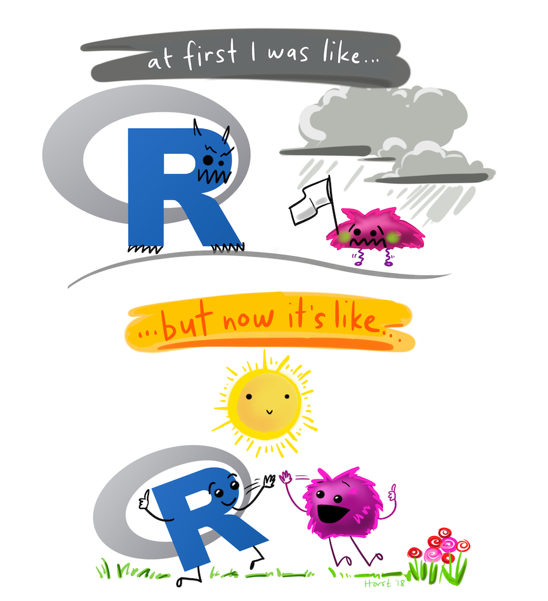

class: middle, title
background-size: contain


<!---- SLIDES SAVED TO PDF USING: 

decktape remark "slides/intro-to-data-analysis-R.html" slides/intro-to-data-analysis.pdf 

using node.js

---->

<br><br>

# An Introduction to Data Analysis using R

<br><br>

**Dr. Calum Webb**<br>
Sheffield Methods Institute, the University of Sheffield<br>
[c.j.webb@sheffield.ac.uk](mailto:c.j.webb@sheffield.ac.uk)

```{r setup, include=FALSE}
options(htmltools.dir.version = FALSE)

# These packages are required for creating the slides
# Many will need to be installed from Github
library(icons)
library(tidyverse)
library(xaringan)
library(xaringanExtra)
library(xaringanthemer)

# Defaults for code
knitr::opts_chunk$set(
  fig.width=9, fig.height=3.5, fig.retina=3,
  out.width = "100%",
  cache = FALSE,
  echo = TRUE,
  message = FALSE, 
  warning = FALSE,
  fig.show = TRUE,
  hiline = TRUE
)

# set global theme for ggplot to make background #F8F8F8F8 (off white),
# but otherwise keep all ggplot themes default (better for teaching)
theme_set(
  theme(plot.background = element_rect(fill = "#F8F8F8", colour = "#F8F8F8"), 
        panel.background = element_rect(fill = "#F8F8F8", colour = "#F8F8F8"),
        legend.background = element_rect(fill = "#F8F8F8", colour = "#F8F8F8")
        )
  )

```

```{r xaringan-tile-view, echo=FALSE}
# Use tile overview by hitting the o key when presenting
xaringanExtra::use_tile_view()
```

```{r xaringan-logo, echo=FALSE}
# Add logo to top right
xaringanExtra::use_logo(
  image_url = "header/smi-logo-white.png",
  exclude_class = c("inverse", "hide_logo"), 
  width = "180px", position = css_position(top = "1em", right = "2em")
)
```

```{r xaringan-themer, include=FALSE, warning=FALSE}

# Set some global objects containing the colours
# of the university's branding
primary_color <- "#131E29"
secondary_color <- "#440099"
tuos_blue <- "#9ADBE8"
white = "#F8F8F8"
tuos_yellow <- "#FCF281"
tuos_purple <- "#440099"
tuos_red <- "#E7004C"
tuos_midnight <- "#131E29"

# The bulk of the styling is handled by xaringanthemer
style_duo_accent(
  primary_color = "#131E29",
  secondary_color = "#440099",
  colors = c(tuos_purple = "#440099", 
             grey = "#131E2960", 
             tuos_blue ="#9ADBE8",
             tuos_mint = "#00CE7C"),
  header_font_google = xaringanthemer::google_font("Source Serif Pro", "600", "600i"),
  text_font_google   = xaringanthemer::google_font("Source Sans Pro", "300", "300i", "600", "600i"),
  code_font_google   = xaringanthemer::google_font("Lucida Console"),
  header_h1_font_size = "2rem",
  header_h2_font_size = "1.5rem", 
  header_h3_font_size = "1.25rem", 
  text_font_size = "0.9rem",
  code_font_size = "0.65rem", 
  code_inline_font_size = "0.85rem",
  inverse_text_color = "#9ADBE8", 
  background_color = "#F8F8F8", 
  text_color = "#131E29", 
  link_color = "#005A8F", 
  inverse_link_color = "#F8F8F8",
  text_slide_number_color = "#44009970",
  table_row_even_background_color = "transparent", 
  table_border_color = "#44009970",
  text_bold_font_weight = 600
)

```


```{r xaringan-panelset, echo=FALSE}
# Allow for adding panelsets (see example on slide 2)
xaringanExtra::use_panelset()
```

```{r xaringanExtra, echo = FALSE}
# Adds white progress bar to top
xaringanExtra::use_progress_bar(color = "#F8F8F8", location = "top")
```

```{r xaringan-extra-styles, echo = FALSE}
# Allow for code to be highlighted on hover
xaringanExtra::use_extra_styles(
  hover_code_line = TRUE,         #<<
  mute_unhighlighted_code = TRUE  #<<
)
```

```{r share-again, echo=FALSE}
# Add sharing links and other embedding tools
xaringanExtra::use_share_again()
```

```{r xaringanExtra-search, echo=FALSE}
# Add magnifying glass search function to bottom left for quick
# searching of slides
xaringanExtra::use_search(show_icon = TRUE, auto_search = FALSE)
```


---

class: middle, inverse

# This is going to be a hands-on training course: all of the information that you need is included in the materials, rather than being split across the slides and the exercises.


---

class: middle


.pull-left[

<br><br>

# R compared to software for Data Analysis 

* `R` is a programming language, rather than just a piece of software.
* `R` has a central repository that holds packages that can expand what you are capable of doing with it.
* `R` is free.
* `R` has a very supportive and active community around it. 
* `R` can do pretty much everything that any commercial software package can do, with a few very niche exceptions.. 

]

.pull-right[

.center[

```{r, echo = FALSE, fig.cap="Artwork by Allison Horst", out.width = "85%"}



```

]

]

---

class: middle, inverse

# "But I'm not a programmer, I never studied computer science/mathematics/intro to programming before"

---

class: middle

.center[

```{r, echo = FALSE, out.width = "70%"}


```

]

---

class: middle

.pull-left[

# If you can use a computer, you can program.

* It's not difficult, it's different. Getting used to something different takes time.
* Instead of clicking virtual or real buttons that apply functions (i.e. make things happen), we give commands by writing text.
* They are called **languages** for a reason — they have their own rules, grammar, and syntax — you have to practice them to get good at them.
* **But**, that doesn't mean you can't use phrasebooks, especially if you only use the language occasionally. 

]

.pull-right[

`open.spotify()`

`search.playlists(search = "instrumental")`

`play.playlist(playlist = "Instrumental Studying Mix")`

`skip.track()`

`rewind.track(seconds = 20)`

`add.track.to.favourites()`

`stop()`

`quit.spotify()`


]

---

class: middle

.center[

```{r, echo = FALSE, out.width = "100%"}


```

]

---

class: middle

.center[

```{r, echo = FALSE, out.width = "70%"}


```

]


---

class: inverse, middle

# We get errors all the time when using computers. The only difference between the errors you just saw and R errors is that the R errors are at least trying to tell you what went wrong.

---

class: inverse, middle

# If you've ever used the "back" `r fontawesome::fa("angle-left")` or "undo" `r fontawesome::fa("arrow-rotate-left")` button, change something, and then do it again to get the result you want — congratulations, you've corrected an error.


---

class: middle

.pull-left[

# What we're going to cover today:

* A general rule for using code in R: things you have to change and things that stay the same. 
* Basic univariate and bivariate descriptive statistics using Base R
* Basic data visualisations using base R
* Common bivariate inferential statistics using base R
* Installing additional packages
* Reading datasets into R, including SPSS datasets
* Descriptive statistics using `tidyverse` and `janitor` tools
* Data visualisations using `ggplot2`

This is your phrasebook to help you on your R learning journey.

]

.pull-right[

<br><br>

.center[

```{r, echo = FALSE, fig.cap="Artwork by Allison Horst", out.width = "100%"}

knitr::include_graphics("images/r_rollercoaster.png")

```

]

]
